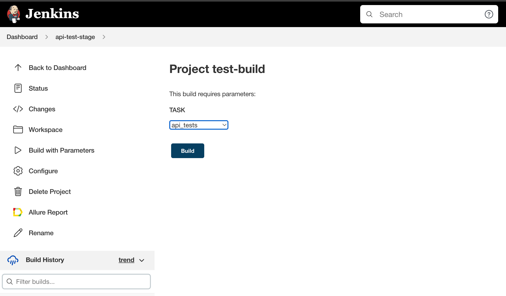
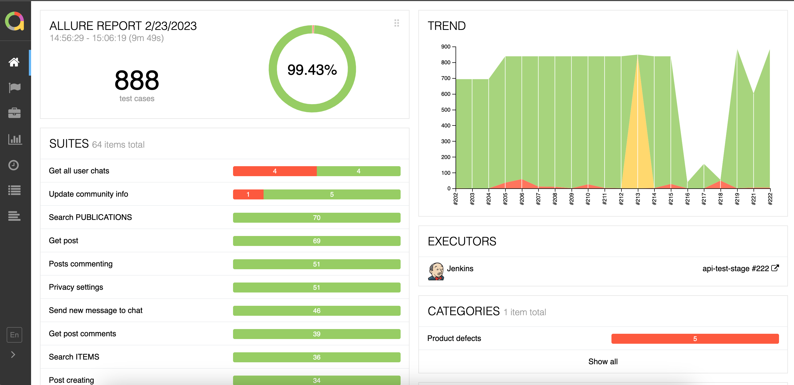
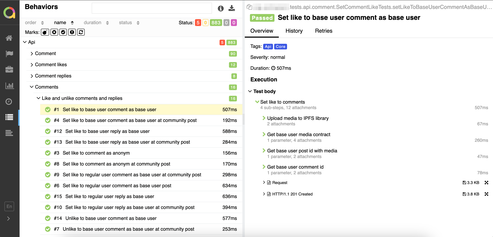
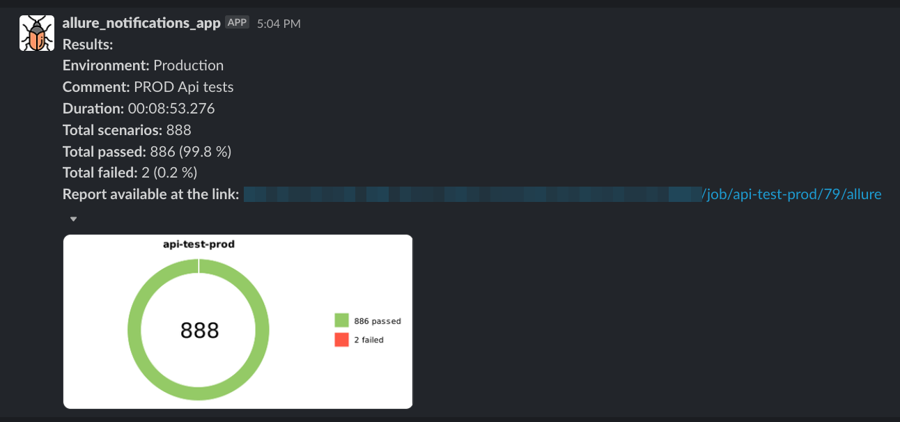

# PET Project Automation Tests

## Technologies and tools

<p align="left">
<a href="https://www.jetbrains.com/idea/"></a>
<a href="https://www.java.com/"></a>
<a href="https://github.com/"></a>
<a href="https://junit.org/junit5/"></a>
<a href="https://gradle.org/"></a>
<a href="https://github.com/allure-framework/allure2"></a>
<a href="https://www.jenkins.io/"></a>
<a href="https://web.telegram.org/"></a>
<a href="https://slack.com/"></a>
</p>

## Test cases

### Api tests:

- Case 1
- Case 2
- Case 3
- ...

### UI tests:

- Case 1
- Case 2
- Case 3
- ...

### Local tests run

```bash
gradle clean test //all tests in project
gradle clean api_test //Api tests
gradle clean web_test //UI tests
```

##  Run tests in Jenkins
To start the build, go to the section <code><strong>*Build with parameters*</strong></code>, choose <code><strong>*Task*</strong></code> you need and click <code><strong>*Build*</strong></code>.

<p align="center">
  
</p>

When the build is completed, in the block <code><strong>*Build history*</strong></code> opposite the build number
the *Allure Report* icon will appear, clicking on which will open a page with the generated HTML Report and Test Documentation.

##  Test results in Allure Report

<p align="center">
  
</p>

<p align="center">
  
</p>

##  Slack or  Telegram notifications 
After the build is completed, a bot, created in <code>Slack</code> or <code>Telegram</code>, automatically processes and sends a message with a test run report.

<p align="center">
